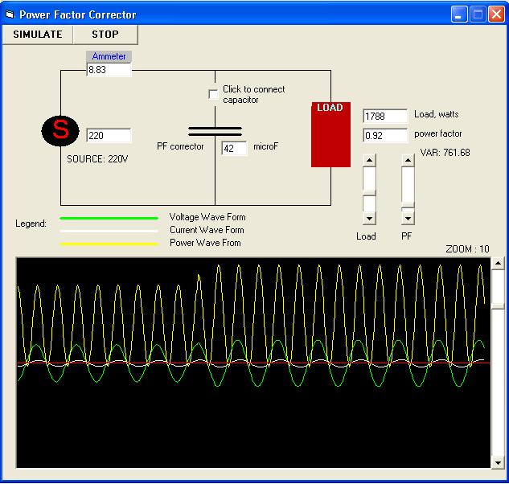



## Power Factor Corrector

### Description

Compute the applicable capacitor to correct power factor of the circuit. Displays waveforms of voltage,current and power
 
### More Info
 
Set the values at the load and pf slider and click simulate. Check connect capacitor to simulate with capacitor.

             |
---                |---
**Submitted On**   |2007-03-23 16:18:02
**By**             |[Arnel Missiona](https://github.com/Planet-Source-Code/PSCIndex/blob/master/ByAuthor/arnel-missiona.md)
**Level**          |Beginner
**User Rating**    |5.0 (10 globes from 2 users)
**Compatibility**  |VB 6\.0
**Category**       |[Miscellaneous](https://github.com/Planet-Source-Code/PSCIndex/blob/master/ByCategory/miscellaneous__1-1.md)
**World**          |[Visual Basic](https://github.com/Planet-Source-Code/PSCIndex/blob/master/ByWorld/visual-basic.md)
**Archive File**   |[Power\_Fact2056133262007\.zip](https://github.com/Planet-Source-Code/arnel-missiona-power-factor-corrector__1-68198/archive/master.zip)

